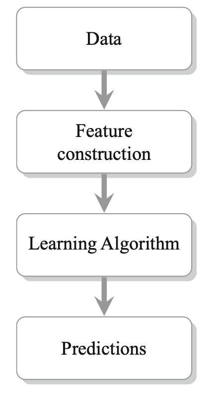

# Kaggle
I created this repo so we can access the datasets of the 2013 Kaggle competition [Cause Effect Pairs Challenge](https://www.kaggle.com/c/cause-effect-pairs) and also the codes from different winners of the competition.

As far as I understand, most of the codes require Python 2.7 along with the following packages:

 - Pandas (version 10.1)
- Sklearn (version 0.13) 
- NumPy (version 1.6.2) 
- Scipy (version 0.10.)

BTW, there are some exceptions. So, I decided to put the README file of each team/repo in its corresponding folder. 

I found the codes from the following teams:

 - [Template](https://github.com/benhamner/CauseEffectPairsChallenge) This was given to all teams at the beginning of the competition.
 - [Ranked 1](https://github.com/diogo149/CauseEffectPairsChallenge)
 - [Ranked 2](https://github.com/jarfo/cause-effect)
 - [Ranked 3](https://github.com/ssamot/causality)
 - [Ranked 5](https://github.com/braincomic/CauseEffectChallenge)
 - [Lopez-Paz Paper](https://github.com/lopezpaz/causation_learning_theory) This is a paper [that was written two years](https://arxiv.org/abs/1502.02398) after the competition but has achieved a higher accuracy score. Most importantly, he has a systematic approach to the problem. And, I believe that we would be better to follow a method similar to this paper.

## Main Idea
While different teams have used different ideas, the general pipeline of most of the teams is similar to the following picture. They take the samples of (x,y, labels) and construct a bunch of features from the given (x,y) pairs. They then apply a classifier to the constructed features.

## Book  
[Cause Effect Pairs in Machine Learning](https://github.com/OmidCharrakh/Kaggle/blob/main/Extra/Cause%20Effect%20Pairs%20in%20ML%202019.pdf) is a book published in 2019. The book studies the competition, and the winner approaches. For example, chapters 10, 11, 12, and 13 focus on the approaches on the Ranked 1, Ranked 3, Ranked 2, and Ranked 5. The general idea of the Lopez-Paz paper is also discussed in chapter 3. 

## Videoes 
[NIPS 2013 Workshop on Causality](http://clopinet.com/isabelle/Projects/NIPS2013/) contains the videos and presentation slides of the winning teams. 

## Datasets 
There were two datasets with the volume of higher then 100mg. I could not push them to the repo. But, if you need them, here you can find the [link to the complete datasets.](https://www.kaggle.com/c/cause-effect-pairs/data)

